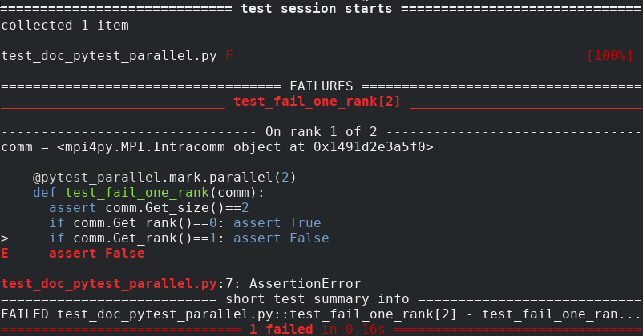
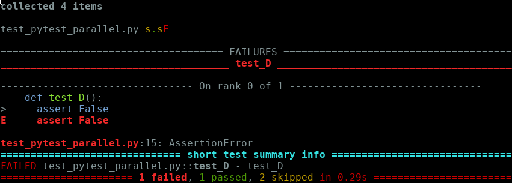
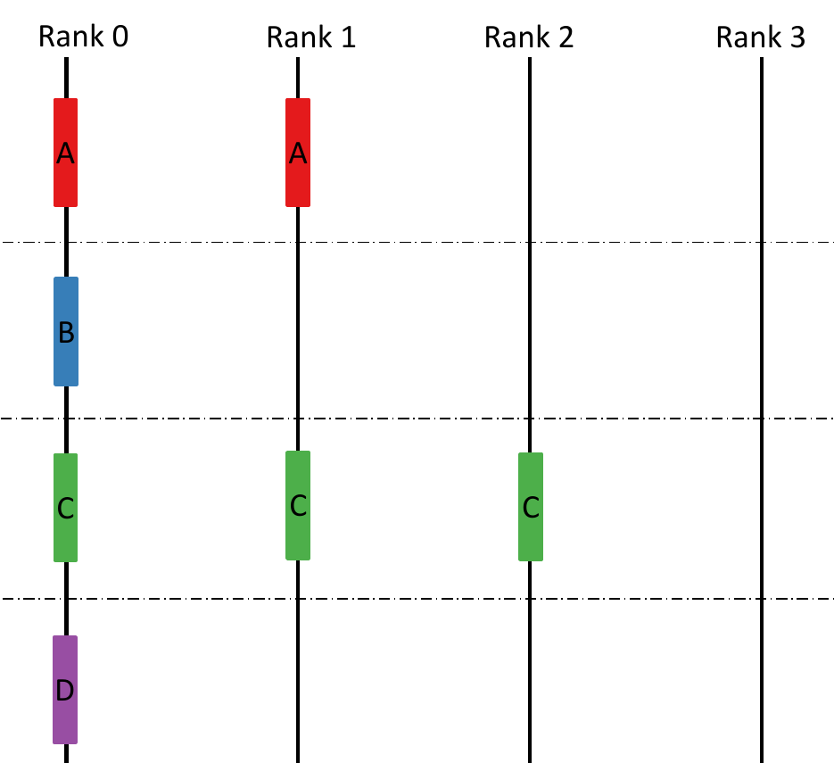
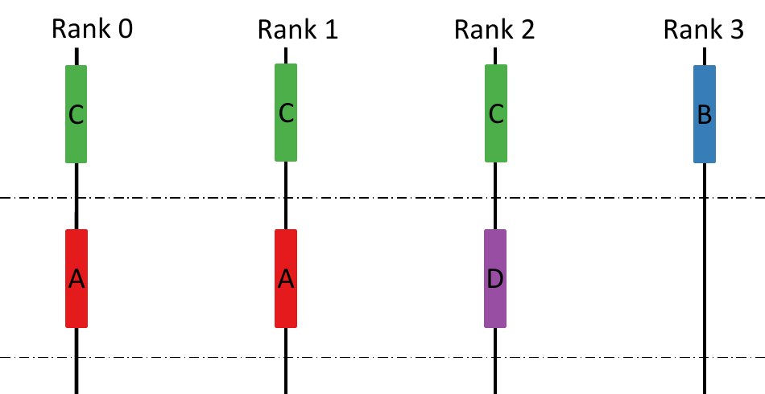
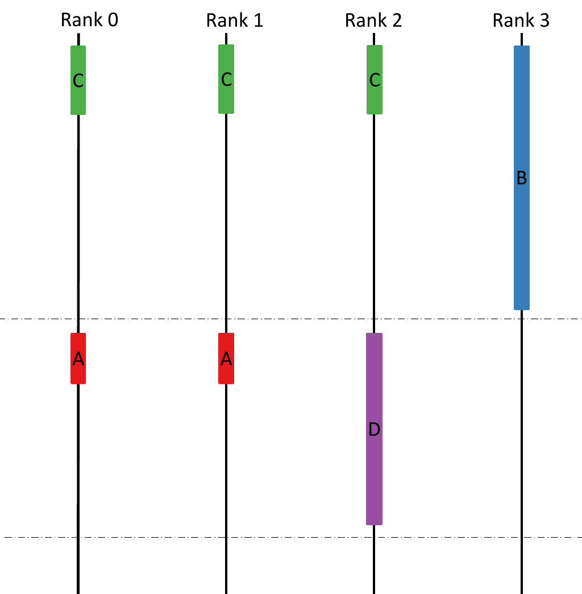
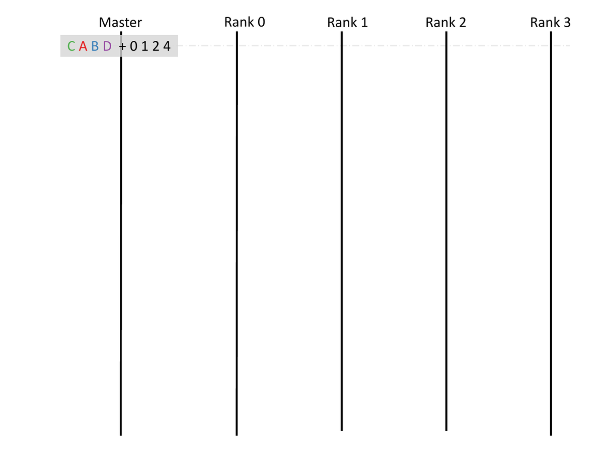

pytest_parallel
===============

**pytest_parallel** extends [PyTest](http://pytest.org) to support parallel testing using [mpi4py](https://mpi4py.readthedocs.io/en/stable/).

[](https://www.python.org/)

[](https://en.wikipedia.org/wiki/Linux)
[](https://en.wikipedia.org/wiki/macOS)
[](https://en.wikipedia.org/wiki/Windows)


## Quick start ##

**pytest_parallel** automates the execution of MPI parallel tests. Let's say you want to precisely test several algorithms, each with a specific number of processes:

```Python
import pytest_parallel

@pytest_parallel.mark.parallel(2)
def test_A(comm):
  if comm.rank == 1: assert False

def test_B():
  assert True

@pytest_parallel.mark.parallel(3)
def test_C(comm):
  assert comm.size == 3

def test_D():
  assert False
```

Tests decorated with `@pytest_parallel.mark.parallel(N)` are specified to run in parallel on `N` processes. The `comm` fixture is a communicator private to the test, with `comm.size == N`.

You can run the tests with MPI, e.g. with:

```Bash
mpirun -np 4 pytest --color=yes -vv test_pytest_parallel.py
```

And the following output will be produced:



If there is not enough MPI processes to run some tests, they will be skipped.
For instance, the following command:

```Bash
mpirun -np 1 pytest --color=yes test_pytest_parallel.py
```

would lead to:



## The `comm` fixture ##

The `comm` fixture you get when decorating your test with `@pytest_parallel.mark.parallel` is a sub-communicator of `MPI.COMM_WORLD` that is unique to each test.

## The `parallel` decorator ##

The `@pytest_parallel.mark.parallel(n_procs)` decorator takes one argument, `n_procs`.

`n_procs` is generally an integer that specifies the size of the communicator that will be given to the test through the `comm` fixture.

`n_procs` can also be a list of integers to parametrize the test. For instance, the following test

```Python
@pytest_parallel.mark.parallel([2,4])
def test_param(comm):
  print(comm.size)
```

will run two times: once with `comm` being a communicator of size 2, once with `comm` being a communicator of size 4.

## Installation ##

### Through pip ###

```Bash
pip install "git+https://github.com/onera/pytest_parallel.git"
```
Note that you can pass the `--user` option to `pip` if you don't have root permissions or want to install `pytest_parallel` in your home directory.

### Manually ###

**pytest_parallel** is a pure PyTest plugin. It depends on mpi4py and Numpy.

To install manually:
```Bash
(mkdir install_dir && cd install_dir && git clone https://github.com/onera/pytest_parallel.git)
export PYTHONPATH=install_dir/pytest_parallel:$PYTHONPATH
export PYTEST_PLUGINS=pytest_parallel.plugin
```

## Schedulers ##

### Process-reuse schedulers ###

Process-reuse schedulers are mostly useful when you have numerous tests that are very fast, typically unit tests. 

For these schedulers, **pytest_parallel** is always launched through MPI, e.g.:

```Bash
mpirun -np 4 pytest test_pytest_parallel.py
```

Here, 4 MPI processes have been spawn by `mpirun`, and **pytest_parallel** will use these 4 processes to run all the tests. This means that one process (let's say the one on rank 2 of `MPI.COMM_WORLD`) will likely be used by several tests.

The main advantage is that the Python environment is loaded once and for all, hence if you have 1000 tests that take 1 millisecond each, and the loading of all your Python modules by the interpreter takes 1 second, then running PyTest will take approximately 2 seconds.

However, the tests are not completely isolated, so if one test crash (e.g. due to a segmentation fault), the segfault message may not point you directly to the faulty test. Deadlocks will also be difficult to pinpoint.

There are 3 kinds of process-reuse schedulers:
- the [sequential scheduler](#sequential-scheduler)
- the [static scheduler](#static-scheduler)
- the [dynamic scheduler](#dynamic-scheduler)

To understand how they work, let's again our previous example:

```Python
import pytest_parallel

@pytest_parallel.mark.parallel(2)
def test_A(comm):
  if comm.rank == 1: assert False

def test_B():
  assert True

@pytest_parallel.mark.parallel(3)
def test_C(comm):
  assert comm.size == 3

def test_D():
  assert False
```

and run it on 4 processes.

#### Sequential scheduler ####

The **sequential** scheduler is the default one. To enable it explicitly, you can pass the `--scheduler=sequential` option to PyTest.

```Bash
mpirun -np 4 pytest --scheduler=sequential test_pytest_parallel.py
```

This scheduler just takes each test in order, one by one, and executes on as many processes it needs. The other processes are sleeping. On our example, this would result in the following sequence diagram:



While it is not optimized for performance, the sequential scheduler is very useful when you get unrecoverable errors (e.g. segfaults) because then your PyTest report may be incomplete. Running tests sequentially allows at least to find which test is at fault.


#### Static scheduler ####

The static scheduler can be selected with:
```Bash
mpirun -np 4 pytest --scheduler=static test_pytest_parallel.py
```

The **static** scheduler tries to distribute tests to minimize the number of idle processes. The process is static, that is, after test collection, it determines which process will execute which test, and in which order. On our example, it will result in the following scheduling:


The scheduler works by steps. Each step has `n_worker` slots (`n_worker` being the number of processes that PyTest was launched with). Each test will try to find a step with enough slots and will consume `n_proc` slots on the step. If no step is found, a new one is created, until each test has a step.

While this scheduler is more optimized, it gives an *a priori* scheduling, hence it is not optimal depending on the duration of the tests. Let's look again at our example, but let's say `test_B` takes much longer than the others. We will then have the following sequence:



We see that processes 0,1 and 2 wait for process 3 to finish the first step, whereas they could do meaningful work.

### Dynamic scheduler ###

The **dynamic** scheduler can be selected with:
```Bash
mpirun -np 4 pytest --scheduler=dynamic test_pytest_parallel.py
```

The scheduler spawns a new MPI process which acts as the master scheduler and sends work to the original processes. The scheduler tries to schedule tests requiring the most processes first. It sends work to idle processes until all the processes are busy executing a test, or when not enough processes are ready to accept a test. It then waits for a signal that workers have finished their test to schedule further work.

Example:


### Process-isolate schedulers ###

Process-isolate schedulers spawn a new process for each new test. Or more exactly, for a test that is specified to use a communicator of size `N`, **pytest_parallel** will launch `N` MPI processes just for this test, and it will do so for each test of the test suite.

Or course, these schedulers are more robust: even if a test crashes with an irrecoverable error, the other tests are not impacted and **pytest_parallel** will report errors correctly. But remember that these schedulers need to start a new Python interpreter and load the Python modules for each test: if you have a lot of fast tests, the start-up times add up.

If you use a process-isolate scheduler, contrary to process-reuse schedulers, you don't launch PyTest through `mpirun -np N`. Rather, you launch PyTest directly and specify the `--n-workers` parameter. 

There are 2 kinds of process-isolate schedulers:
- the shell scheduler
- the SLURM scheduler

#### Shell scheduler ###

The **shell** scheduler can be selected with:
```Bash
pytest --n-workers=4 --scheduler=shell test_pytest_parallel.py
```
The scheduling algorithm is the same as the [static scheduler](#static-scheduler).

#### SLURM scheduler ###
The **SLURM** scheduler can be selected with:
```Bash
pytest --n-workers=4 --scheduler=slurm test_pytest_parallel.py
```
SLURM takes care of the scheduling. This scheduler as specific options:
- `--slurm-options`: a list options for `sbatch`. For example: `--slurm-options="--time=00:30:00 --qos=my_queue"`. Do **not** specify `--ntasks` here, **pytest_parallel** will use the value given by `--n-workers`.
- `--slurm-srun-options`: a list options for `srun`. For example: `--slurm-srun-options="--mem-per-cpu=4GBb"`
- `--slurm-export-env`: should the SLURM job use the same environment as the terminal that spawned it? Enabled by default.
- `--slurm-additional-cmds`: commands to pass to the SLURM job that should be executed before the tests. Example: `--slurm-additional-cmds="source my_env.sh"`


## FAQ ##

### Which MPI implementation is supported?

**pytest_parallel** has currently been tested and is used daily with OpenMPI and Intel MPI. MPICH is also regularly tested though the GitHub CI with the process-reuse schedulers. Other MPI implementations are also supposed to work. An exception is the `shell` scheduler that use implementation-specific environment variables to pin the processes to cores. Feel free to give use feedback/patches.

### Which OS is supported?

**pytest_parallel** is daily tested and used on Linux machines. However, on the GitHub CI, the `sequential`, `static` and `dynamic` schedulers work with Mac OS, and the `sequential` and `static` schedulers work with Windows.

### Which job scheduler is available?

Currently SLURM is the only job scheduler available. Other job schedulers (PBS, LFS...) are not supported currently. If you don't use SLURM, the `shell` scheduler may be enought for your tests as long as you dont want to use more than one compute node.


### **pytest_parallel** gives me a new communicator for each test, but my code only uses `MPI.COMM_WORLD`, how can I use **pytest_parallel**?

The [process-isolate schedulers](#process-isolate-schedulers) can be used with tests using different sizes of `MPI.COMM_WORLD`. The `comm` fixture can then be discarded:

```Python
import pytest_parallel
from mpi4py import MPI

@pytest_parallel.mark.parallel(2)
def test_fail_one_rank(comm):
  assert comm.size == MPI.COMM_WORLD.size
  my_algo_implicitly_using_MPI_COMM_WORLD()

@pytest_parallel.mark.parallel(3)
def test_fail_one_rank(comm):
  # `comm` is unused but you currently need to write it down anyway
  my_other_algo_implicitly_using_MPI_COMM_WORLD()
```

```Bash
mpirun -np 4 pytest --scheduler=shell test_pytest_parallel.py
```

For unit tests, process-isolate schedulers are very slow, and **[process-reuse schedulers](#process-reuse-schedulers) will not work**. We really encourage you to generalize your function with an additional `comm` argument that is used for communication, rather than forcing your users to `MPI.COMM_WORLD`.
It would be possible to develop hybrid process-reuse schedulers where processes are re-used, but only among tests of the same communicator size (and repeat the operation for as many communicator sizes there are on the test suite). If you feel the need, write a feature request and maybe we will implement it.


### Can I write an MPI test with no fixed number of processes and let **pytest_parallel** use `MPI.COMM_WORLD`?

Not currently. **pytest_parallel** is designed to dissociate the parallelism specified for each test and the resources given to execute them.
If the need arizes, we could however:
- implement a mode that would use the number of processes given by the command line instead of the one specified with each test
- add a `@pytest_parallel.mark.parallel_from_context` decorator that would mark the test to be run with the maximum parallelism specified (that is, the number of processes given by the command line)

### My test suite deadlocks. How do I pinpoint the test at fault?

There is no magic technique. Try to narrow it down by using the [sequential scheduler](#sequential-scheduler).

A solution that we need to implement is to handle timeouts for the [process-isolate schedulers](#process-isolate-schedulers). Feel free to submit a feature request.

### Why is the [shell scheduler](#shell-scheduler) using a static scheduling strategy?

The [shell scheduler](#shell-scheduler) uses the same scheduling algorithm as the [static scheduler](#static-scheduler) because it is easier to implement. We hope to also implement a dynamic scheduling strategy if we feel the need for it.

### I want to use the static shell scheduler, but I have the error `MPI_INIT failed`

On some systems, using `mpi4py` without `mpirun` does not work. For example, using:
```Bash
pytest --n-workers=4 --scheduler=shell test_pytest_parallel.py
```

produces the following error:
```
Error obtaining unique transport key from PMIX (OMPI_MCA_orte_precondition_transports not present in
the environment).

It looks like MPI_INIT failed for some reason; your parallel process is
likely to abort.  There are many reasons that a parallel process can
fail during MPI_INIT; some of which are due to configuration or environment
problems.  This failure appears to be an internal failure; here's some
additional information (which may only be relevant to an Open MPI
developer):
```

In this case, try:
```Bash
mpirun -np 1 pytest --n-workers=4 --scheduler=shell test_pytest_parallel.py
```

### Can I use **pytest_parallel** with MPI and OpenMP/pthreads/TBB?

We do not use **pytest_parallel** with multi-treading, any feedback is welcomed! Regarding the `shell` scheduler, we explicitly pin one MPI process per core, with is probably wrong with multiple threads by MPI process.

## Plugin compatibility ##

**pytest_parallel** is known to work with the **pytest-html** plugin. It is also compatible with the xml built-in plugin.

No other plugin has been tested, feedback is welcomed.


## Implementation notes ##

### Use of PyTest hooks ###
We use PyTest hooks to schedule tests and gather report information from remote processes. That is, mainly:
 * either `pytest_collection_modifyitems` or `pytest_runtestloop` to schedule tests
 * `pytest_runtest_logreport` to gather test reports
 * `pytest_pyfunc_call` to prevent the actual test code to be executed when it is actually executed on the other process

PyTest expects its complete "pipeline" to be executed for all messages to be reported correctly, so we have to trick it:
 * make it think that every test was run on the master rank.
 * de-activate logging on other ranks

### Implementation of process-isolate schedulers ###

In both cases, we have a master process (the one launched by the user) that will spawn worker processes. The master then waits to receive test reports from the workers.

#### Information exchange ####

The master and worker processes exchange information through sockets. Master creates a socket, then spawns workers by giving them the information of the socket (its ip and port), so that they can connect to it to send their report.

Actually, in order to correctly report crashes, the report of each test is created in two steps:
- First, `pytest --_worker` is launched. It runs the test `t` and writes a report at each of its stages `s` (`setup`/`call`/`teardown`) in the file `.pytest_parallel/tmp/{t}_{s}`.
- Then, when `pytest --_worker` is done for the test (either because it finished or because it crashed), the `pytest_parallel.send_report` module is run. It looks for the files that `pytest --_worker` has supposedly written. If the files are there, they are sent to master through the socket. If one of the file is missing, it means that the process crashed. In this case, a crash report is created and is sent to master through the socket.

#### Fake-running a test on master ####

To trick PyTest into thinking the test is run by the master process, it runs `pytest_runtest_protocol` for each test but with the following hooks:
- `pytest_pyfunc_call` does nothing (i.e. does not actually execute the test)
- `pytest_runtest_logreport` creates a report by using the one that was received from the worker

#### Shell scheduler specifics ####

File: `shell_static_scheduler.py`

The master process gather tests in "steps" according to the [static scheduling](#static-scheduler) algorithm. Then, for each step `i`:
- The master process writes a bash script in `.pytest_parallel/pytest_static_sched_{i}.sh`.
- It launches the script. All the tests of the step are run in parallel (through `&` and `wait`). The script pins exactly one core per MPI process.
- The master process waits to receive the test reports.
- When it has all the reports of the tests of the step, it reports them ([by fake-running the tests](fake-running-a-test-on-master)).
- It moves to the next step.

#### SLURM scheduler specifics ####

File: `process_scheduler.py`

The master process writes a SLURM job `.pytest_parallel/job.sh` that is submitted through `sbatch`. In the job, to each test corresponds a "job step" launched with `srun --exclusive [...] &`. The `--exclusive` and `&` enables SLURM to schedule the job steps as best as it can. The job then waits for all the tests to finish (this is the `wait` command at the end of the script). (Note: contrary to `sbatch`, the `--exclusive` option of `srun` does not mean that we want the ressource to be exclusive to the job)

Once submitted, the master process wait to receive test reports. Each time it receives a report, it treats it immediately ([by fake-running the test](fake-running-a-test-on-master)).

### Performance detail ###

For the static and dynamic schedulers, on the master process, we must execute the test protocol, while not really running the test if it was scheduled on a remote process.

This can be done by hooking `pytest_runtest_setup/call/teardown`. However, we observed it was greatly degrading performance (x5 !), so instead we just copy-pasted the `_pytest/runner/pytest_runtest_protocol` and hard-coded the execution shortcut.

### Design alternative ###

Regarding the dynamic scheduler, instead of spawning a new MPI **process**, it would have been possible to spawn a new **thread** on process 0. However, it would then require to use `MPI_thread_init` with a value of at least `MPI_THREAD_FUNNELED`, and in practice, `MPI_THREAD_MULTIPLE` to ease the implementation of self-communication on rank 0. Here, no thread level is required (i.e. `MPI_THREAD_SINGLE` is **fine**).

Another possibility would have been to use sockets for communications between the scheduling process and the worker processes (instead of using MPI inter-communicators). We used `MPI_Comm_spawn` because at the time we had no experience with sockets. Re-implementing the dynamic scheduler using sockets may be useful to make it more robust.


## Contributing ##

Any contributions are welcome: bug report, feature requests, general feedback, pull requests. If you want to contribute a non-trivial pull-request, please begin by opening an issue explaining what you want to do in order to iterate on the best way to do it.

## Future work ##

* More configuration options for the binding of MPI processes
* Dynamic scheduler: schedule a test not only if enought procs are available, but also if the procs belong to some common NUMA domain (cluster, CPU, node...)
* Reserve more procs than declared in the test. Useful for loading and scaling performance tests. Possible API:
```Python
@pytest_parallel.mark.parallel(4, exclusive_numa_domain='cpu')
```
* Dynamic scheduler: more asynchrony (send -> isend)
* Add the process-isolate scheduler to the CI