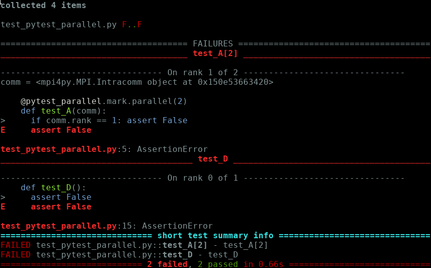

pytest_parallel
===============

**pytest_parallel** extends [PyTest](http://pytest.org) to support parallel testing using mpi4py.

[](https://www.python.org/)

[](https://en.wikipedia.org/wiki/Linux)
[](https://en.wikipedia.org/wiki/macOS)
[](https://en.wikipedia.org/wiki/Windows)


## Introduction ##

```Python
import pytest_parallel

@pytest_parallel.mark.parallel(2)
def test_fail_one_rank(comm):
  assert comm.Get_size()==2
  if comm.Get_rank()==0: assert True
  if comm.Get_rank()==1: assert False
```

Here a test that should run on two processes is declared. When the test suite is run, the test will execute on two MPI processes. The `comm` fixture is an mpi4py communicator that is private to the test.

The test can be run on two processes, e.g. with:

```Bash
mpirun -np 2 pytest --color=yes test_pytest_parallel.py
```

And the following output will be produced:



If there is not enough MPI processes to run the test, it will be skipped.
For instance, the following launching command:

```Bash
mpirun -np 1 pytest --color=yes test_pytest_parallel.py
```

would lead to:


## The `comm` fixture ##

The `comm` fixture that you get when decorating your test with `pytest_parallel.mark.parallel` is a sub-communicator of `MPI.COMM_WORLD` that is unique to each test.

## The `parallel` decorator ##

The `pytest_parallel.mark.parallel(n_procs)` decorator takes one argument, `n_procs`.

`n_procs` is generally an integer that specifies the size of the communicator that will be given to the test through the `comm` fixture.

`n_procs` can also be a list of integers to parametrize the test. For instance, the following test

```Python
@pytest_parallel.mark.parallel([2,4])
def test_param(comm):
  print(comm.Get_size())
```

will run two times: once with `comm` being a communicator of size 2, once with `comm` being a communicator of size 4.

## Schedulers ##

**pytest_parallel** comes with three kind of schedulers. To understand how they work, let's take the following example:

```Python
import pytest_parallel

@pytest_parallel.mark.parallel(2)
def test_A(comm):
  if comm.Get_rank()==1: assert False

def test_B():
  assert True

@pytest_parallel.mark.parallel(3)
def test_C(comm):
  assert comm.Get_size() == 3

def test_D():
  assert False
```

Let's also fix the number of workers that we will be using to 4. This means that the test is launched with:

```Bash
mpirun -np 4 pytest test_pytest_parallel.py
```

### Sequential scheduler ###

The **sequential** scheduler just takes each test in order, one by one, and executes it on as many processes as it needs. The other processes are sleeping. On our example, this would result on the following sequence diagram:


While it is not optimized for performance, the sequential scheduler is very useful when you get unrecoverable errors (e.g. segfault) because then your PyTest report may be incomplete. Running tests sequentially allows at least to find which test is at fault.

The sequential scheduler is the default one. To enable it explicitly, you can pass the `--scheduler=sequential` option to PyTest.


### Static scheduler ###

The **static** scheduler tries to distribute tests to minimize the number of idle processes. The process is static, that is, after test collection, it determines which process will execute which test, and in which order. On our example, it will result in the following scheduling:


The scheduler works by steps. Each step has `n_worker` slots (`n_worker` being the number of processes that PyTest was launched with). Each test will try to find a step with enough slots and will consume `n_proc` slots on the step. If no step is found, a new one is created, until each test has a step.

While this scheduler is more optimized, since it gives an a priori scheduling, it is not optimal depending on the duration of the tests. Let's look again at our example, but let's say `test_B` takes much longer than the others. We will then have the following sequence:


We see that processes 0,1 and 2 wait at the first step for process 3 to finish.

### Dynamic scheduler ###

The **dynamic** scheduler spawns a new MPI process which acts as the master scheduler and sends work to the original processes. The scheduler tries to schedule tests requiring the most processes first. The scheduler tries to send work to idle process until all the processes are busy executing one test, or when not enough processes are ready to accept a test. It then waits for a signal that workers have finished their test to schedule further work.

Example:


#### Design alternative ####

Instead of spawning a new MPI **process**, it would have been possible to spawn a new **thread** on process 0. However, it would then require to use `MPI_thread_init` with a value of at least `MPI_THREAD_FUNNELED`, and in practice, `MPI_THREAD_MULTIPLE` to ease the implementation of self-communication on rank 0. Here, no thread level is required (i.e. `MPI_THREAD_SINGLE` is **fine**).


## Prerequisites ##

**pytest_parallel** is a pure PyTest plugin. It depends on mpi4py and Numpy

## Plugin compatibility ##

**pytest_parallel** is known to work with the **pytest-html** plugin. It is also compatible with the xml built-in plugin.

No other plugin has been tested.

## Implementation notes ##

We use PyTest hooks to schedule tests and gather report information from remote processes. That is, mainly:
 * either `pytest_collection_modifyitems` or `pytest_runtestloop` to schedule tests
 * `pytest_runtest_logreport` to gather test reports
 * `pytest_pyfunc_call` to prevent the actual test code to be executed when it is actually executed on the other process

PyTest expects its complete "pipeline" to be executed for all messages to be reported correctly, so we have to trick it:
 * make it think that every test was run on the master rank.
 * de-activate logging on other ranks

### Performance detail ###

For the static and dynamic schedulers, on the master process, we must execute the test protocol, while not really running the test if it was scheduled on a remote process.

This can be done by hooking `pytest_runtest_setup/call/teardown`. However, we observed it was greatly degrading performance (x5 !), so instead we just copy-pasted the `_pytest/runner/pytest_runtest_protocol` and hard-coded the execution shortcut.


## TODO ##

* Binding of MPI processes
* Schedule a test not only if enought procs are available, but also if the procs belong to some common NUMA domain (cluster, CPU, node...)
* Reserve more procs than declared in the test. Useful for loading and scaling performance tests. Possible API:
```Python
@pytest_parallel.mark.parallel(4, exclusive_numa_domain='cpu')
```
* Dynamic scheduler: more asynchrony (send -> isend)
